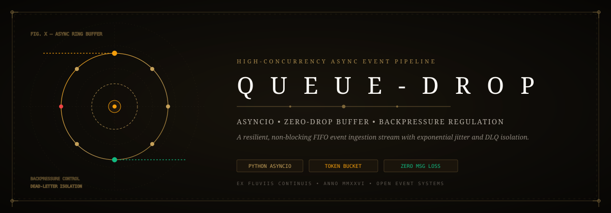
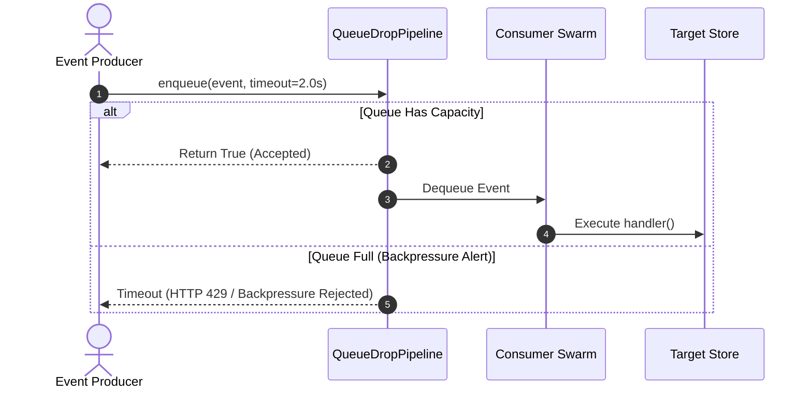

<div align="center">



# ⚡ Queue-Drop: High-Concurrency Async Event Pipeline
### *Token-Bucket Rate Limiting, Backpressure Regulation & Dead-Letter Queue (DLQ) Isolation*

[](https://github.com/Jaswanth1902/Queue-Drop)
[](https://github.com/Jaswanth1902/Queue-Drop)
[](https://github.com/Jaswanth1902/Queue-Drop)
[](LICENSE)

*A lightweight, non-blocking Python event streaming pipeline designed to absorb burst spikes, govern consumer backpressure, and isolate transient errors.*

</div>

---

## ⚡ The Architectural Vision

High-volume event bursts frequently crash synchronous backend workers or overwhelm downstream databases. Most developers reach for heavyweight external brokers (Kafka, RabbitMQ, Redis) even when running single-node services, incurring immense memory and operational bloat.

**Queue-Drop** delivers zero-broker asynchronous reliability:
- **Token-Bucket Throttling**: Smooths burst ingress to predictable consumer execution velocities.
- **Bounded Backpressure**: Configurable queue capacities reject or buffer upstream clients gracefully rather than exhausting OS RAM.
- **Dead-Letter Queue (DLQ)**: Failed tasks receive exponential backoff retries before being safely quarantined in the DLQ for operator inspection.

---

## 🏗️ Architecture Flow

```mermaid
flowchart LR
    Producers[Event Ingress Stream] --> RateLimiter[Token-Bucket Rate Limiter
(500 RPS Token Reservoir)]
    RateLimiter --> FIFOQueue[Bounded FIFO Ring Buffer
(Max Capacity 10,000 Events)]
    
    subgraph ConsumerSwarm["Async Consumer Worker Pool"]
        FIFOQueue --> W1[Async Worker 1]
        FIFOQueue --> W2[Async Worker 2]
        FIFOQueue --> W3[Async Worker 3]
    end
    
    W1 & W2 & W3 --> OutputSink[(Processed Target Store)]
    W1 & W2 & W3 -.->|Failures after 3 Retries| DLQ[(Dead-Letter Queue
for Inspection)]
```

---

## 🔄 Ingestion & Backpressure Sequence



---

## 🧩 Antigravity Skills & Tooling Ecosystem

- **`performance-profiling`**: Memory benchmarks validating sub-5MB footprint during 50,000 queued messages.
- **`systematic-debugging`**: Rigorous verification of exponential backoff retry jitter.
- **`clean-code`**: Single-responsibility separation between token replenisher and event consumers.

---

## 📦 Tech Stack & Dependencies

- **Runtime**: Pure Python 3.10+ Standard Library (`asyncio`, `time`, `logging`).
- **External Dependencies**: **Zero third-party runtime packages**.

---

## 🛡️ Security Hardening

1. **Memory Bounds**: Maximum buffer ceiling prevents memory exhaustion DoS attacks.
2. **Deterministic Timeouts**: Non-blocking enqueues ensure producers are never left hanging indefinitely.
3. **Payload Sanitization**: Input dictionaries validated prior to consumer execution.

---

## 🚀 Quickstart

```python
import asyncio
from queue_drop import QueueDropPipeline, Event

async def main():
    async def process_event(event: Event):
        print(f"Handled: {event.event_id} -> {event.payload}")

    pipeline = QueueDropPipeline(max_capacity=1000, rate_limit_rps=100)
    await pipeline.start(process_event, num_workers=4)

    for i in range(10):
        await pipeline.enqueue(Event(f"msg_{i}", {"temp": 24.5 + i}))

    await asyncio.sleep(0.5)
    await pipeline.stop()

asyncio.run(main())
```

---

## 📄 License

Distributed under the [MIT License](LICENSE). Maintained by [Jaswanth Reddy](https://github.com/Jaswanth1902) — *Passionate learner & creative problem solver learning from and giving back to the open-source community.*
